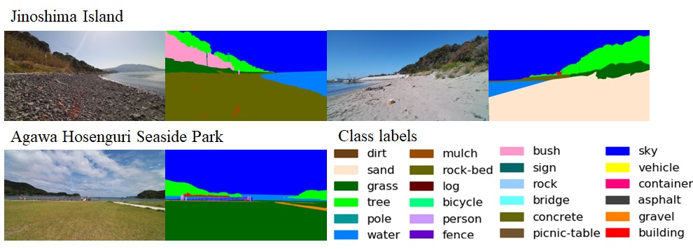
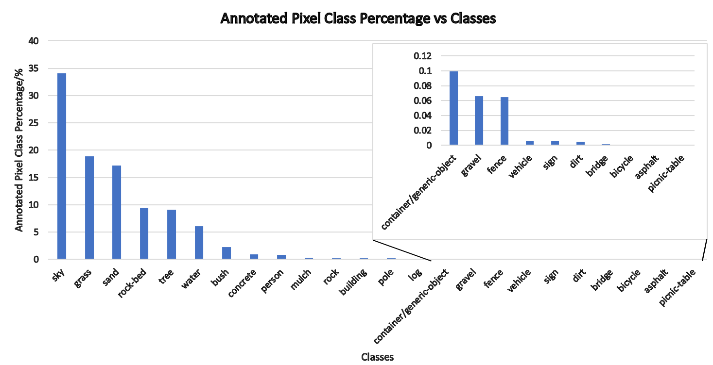
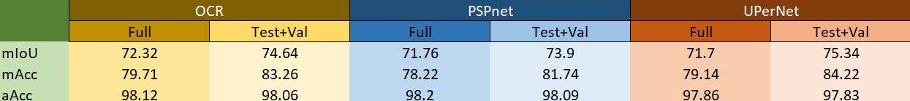

# The BCRobo dataset for Robotic Vision and Autonomous Path Planning in Outdoor Beach Environment
***Author:*** Sam Tan Chi Jie (chijie1998@hotmail.com/ tan.jie-chi339@mail.kyutech.jp)

BCRobo dataset is a highly specialized dataset that contains high resolution beach environment images captured by a field exploration robot, SOMA.

[SOMA](https://alife-robotics.co.jp/members2020/icarob/data/html/data/OS/OS23/OS23-5.pdf).

As part of the development team for SOMA, we are trying to implement our robot in beach environment. However, we could not find any semantic dataset for beach environment and decided to make our own dataset. We made this public for everyone to use it.

### Class and Labels
The labels of this dataset is adapted from [KITTI](https://www.cvlibs.net/publications/Geiger2013IJRR.pdf) and [RUGD](http://rugd.vision/) dataset. 

There is a total of 22 classes but in the labels.txt file, we keep two extra classes (asphalt and picnic-table) as we wish to train it with RUGD dataset.

### Dataset Download

    .
    ├── ...
    ├── Jinoshima           # 393 images
    │   ├── ori          
    │   ├── anno        
    ├──  Agawa Hosenguri    # 292 images
    │   ├── ori          
    │   ├── anno        
    └── ...
    
The RGB and annotated ground truth images are available for download [here].

Lidar and GPS data are also available in the form of ROSbag upon request.

### Benchmark
First, we have partitioned our dataset into train (80%), test (10%) and validation set (10%). Split text file is available [here](docs/splits).
In order to evaluate our dataset, we have selected **3 image segmentation models** and trained with our dataset:

1. [PSPnet](https://arxiv.org/pdf/1612.01105.pdf)   – ResNet50 – d8 backbone
2. [OCRnet](https://arxiv.org/pdf/1909.11065.pdf)   – ResNet50 – d8 backbone
3. [UPerNet](https://arxiv.org/pdf/1807.10221.pdf)  – ResNet50

##### Training Environment:
-	Ubuntu LTS 20.04
-	AMD Ryzen Threadripper 3960X 24-Core
-	Nvidia RTX 3090 – 3 units
-	[MMSegmentation v0.29.1](https://github.com/open-mmlab/mmsegmentation)

##### Training Configuration:
- SGD optimizer with momentum of 0.9
- Polynomial learning rate policy with weight decay of 0.0004
- Learning rate of 0.015 and min learning rate of 0.0001
- Linear warm up for 1000 iteration
- Train based on Epoches for 2000 epoches (around 60000 iterations)
- 6 images per GPU (batch size = 6 x 3)
- 8 workers per GPU

##### Experimental Evaluation:

We evaluate the test+val sets as well as train+test+val sets with the trained models with standard semantic segmentation metrics which are mean Intersection-over-Union (**mIoU**) and mean pixel-wise classification accuracy (**mAcc**). 

### Reproduce benchmark
1. Download Arduino IDE and Teensyduino following this [official guide](https://www.pjrc.com/teensy/td_download.html). If you are not using teensy you may ignore this, you only need the arduino IDE. 

2. Find your Arduino folder usually located at Home. Download and put the ICM42688 and KalmanFilter folder in Arduino/libraries.

3. Open Arduino IDE, select Sketch and include libraries. You should be able to see and choose ICM42688 and KalmanFilter.

4. You may follow the guide from [Arduino](https://docs.arduino.cc/software/ide-v1/tutorials/installing-libraries) too if step 2 and 3 does not work for you.

### Cite us
Please cite this paper if you have used this dataset in your work

### Credit and References

Everyone involves in this project in Hayashi Eiji Laboratory Kyutech Japan.

[KITTI](https://www.cvlibs.net/publications/Geiger2013IJRR.pdf) 

[RUGD](http://rugd.vision/)

[PSPnet](https://arxiv.org/pdf/1612.01105.pdf)   

[OCRnet](https://arxiv.org/pdf/1909.11065.pdf)   

[UPerNet](https://arxiv.org/pdf/1807.10221.pdf)  

[MMSegmentation](https://github.com/open-mmlab/mmsegmentation)
